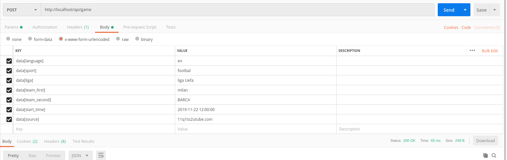
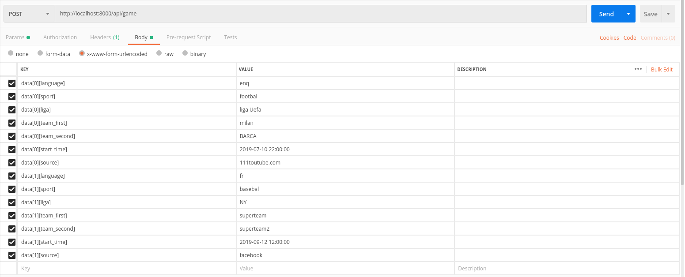
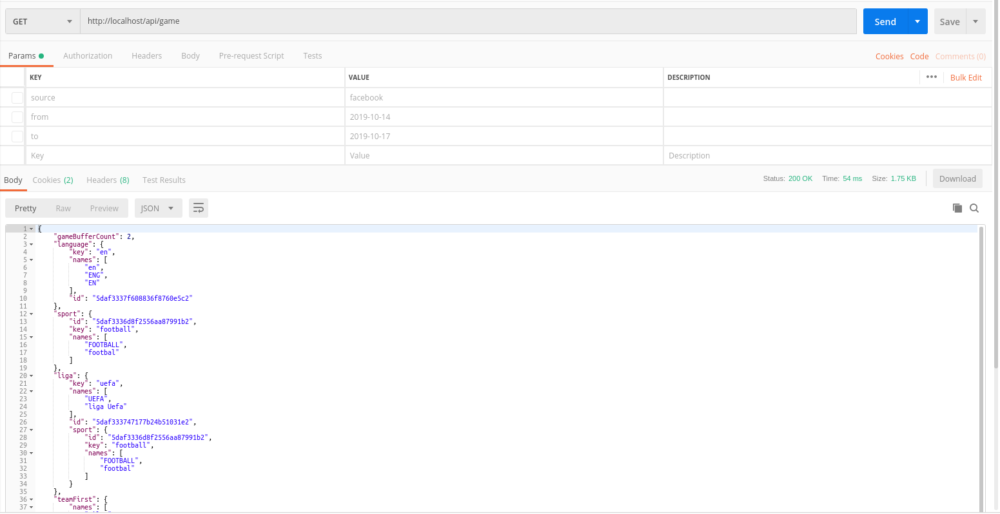

Sport Information collector APP
===============

## Content

[TASK](https://docs.google.com/document/d/1RhVlrc76FDsrXjJyJQZu9SJp4o3b2cARz-ah4xmJAVM/edit)

1. [Stack](#stack)
2. [Deploy](#deploy)
3. [Usage](#usage)

#Stack

1. Symfony (4.3.5)
2. Mongo (4.2)
3. Docker (Docker version 19.03.2)

# Deploy

React applications for Oklend Platform

1. pull repo
2. run `docker-compose -f docker-compose.yaml -f docker-compose.mysql.yaml build`
3. run `docker-compose -f docker-compose.yaml -f docker-compose.mongodb.yaml up -d`
4. run `docker-compose exec app ./bin/setdb.sh` to generate data for test usage

# Usage

###Endpoints
1. GET `http://localhost/api/game` in order to get information about random game with all related data
2. POST `http://localhost/api/game` in order to save data about game

##Data structure
Create single game item

###Create many games item

###Get game

