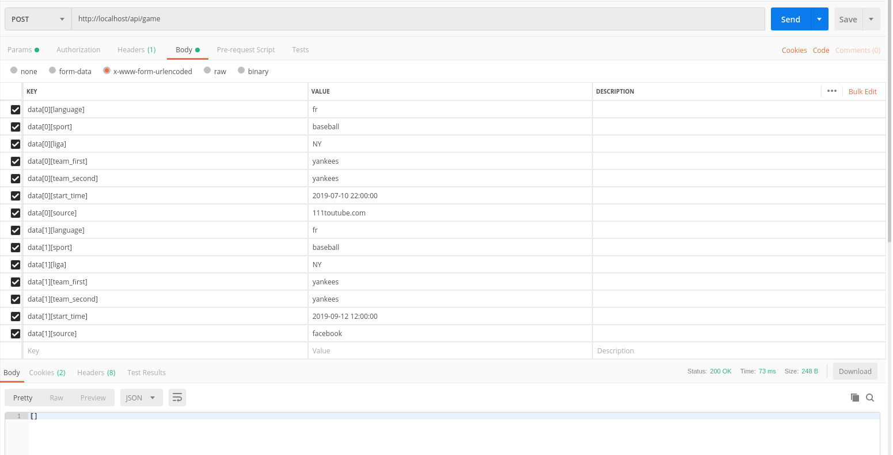

Sport Information collector APP
===============

### [TASK](https://docs.google.com/document/d/1RhVlrc76FDsrXjJyJQZu9SJp4o3b2cARz-ah4xmJAVM/edit)

1. [Stack](#stack)
2. [Deploy](#deploy)
3. [Usage](#usage)

# Stack

1. Symfony (4.3.5)
2. Mongo (4.2)
3. Docker (Docker version 19.03.2)

# Deploy

Before install you should release ports in your local machine
1. `:::27017` for mongo service and `:::80` for main app
2. pull repo
3. run `docker-compose -f docker-compose.yaml -f docker-compose.mongodb.yaml build`
3. run install composer ` docker-compose exec app chown -R www-data:1000 /srv` and `docker-compose exec -u www-data app composer install`
4. run `docker-compose -f docker-compose.yaml -f docker-compose.mongodb.yaml up -d`
5. run `docker-compose exec app ./bin/setdb.sh` to generate data for test usage

Optionally run feature API tests `docker-compose exec app ./bin/phpunit`

# Usage

### Endpoints
1. GET `http://localhost/api/game` in order to get information about random game with all related data
2. POST `http://localhost/api/game` in order to save data about game

## Data structure
Create single game item

### Create many games item

### Get game

